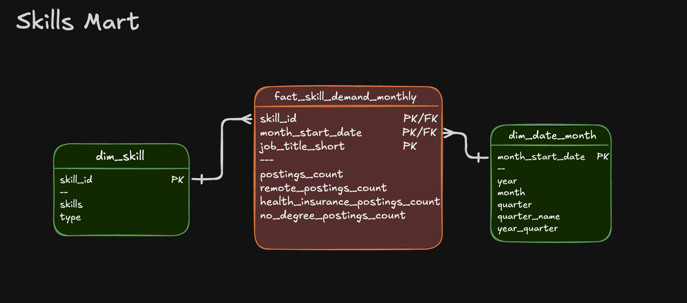
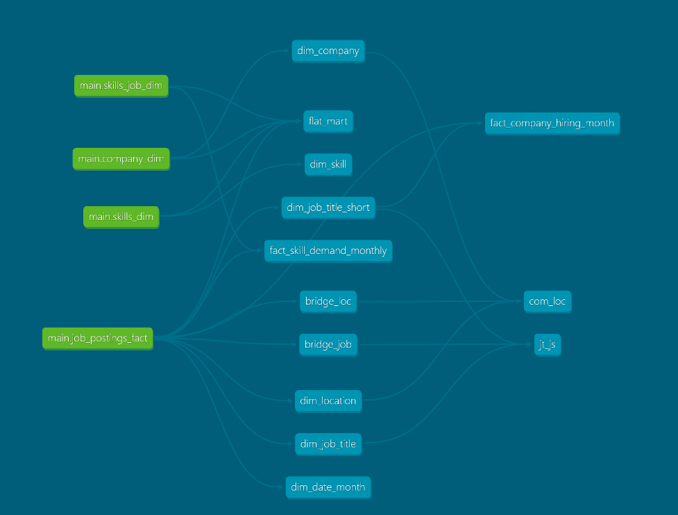

# Data Warehouse & Mart Build: ELT Pipeline

This project follows Luke Barousse's SQL for Data Engineering youtube tutorial video, combined with snowflake + DBT + PowerBI implementation. If you want the full explanation of the methodology of this project, go to his Git Repo. I will mainly be explaining **my own end-to-end process** using snowflake and dbt on top of the tools used in the tutorial


-----------------------------------

## 🧰 Tech Stack (tutorial)

- 🐤 Database: DuckDB
- 🧮 Language: SQL
- 📊 Data Model: Star schema
- 🛠️ Development: VS Code + Terminal Bash
- 📦 Version Control: Git/GitHub
- ☁️ Storage: Google Cloud Storage

## 🧰 Tech Stack (added on)

- 🐤 Database: Snowflake (replicate real world structure)
- 🧮 Language: Python (ingestion)
- 🛠️ Development: DBT (dependency management and documentation)
- 📊 Visualisation: Power BI

---------------------

## 🏗️ Set Up
### Terminal Bash
- Download [Git](https://git-scm.com/), swapped Windows Power Shell for Git Bash
### VS Code
- Download [VS Code](https://code.visualstudio.com/), acts as main IDE for coding and version control. Data ingestion and script writing happens here
### Python
- In this project, python was used for data ingestion only, connected ingested data to Snowflake. As of 23/6/2026, used Python 3.11 becasue latest version of python did not work with current snowflake version
 ```python
import pandas as pd
from snowflake.connector.pandas_tools import write_pandas
import snowflake.connector

conn = snowflake.connector.connect(
    user='kebinn',
    password='As_JGPmY2TQ!h76',
    account='pz30598.ap-southeast-1',
    warehouse='dw_marts_wh',
    database='dw_marts',
    schema='main'
)

def ingest(data, name):
    write_pandas(
    conn,
    data,
    name,
    quote_identifiers=False,
)
```

### Snowflake
- Set up [Snowflake](https://www.snowflake.com/en/) and create roles, warehouse, database and schemas
- In Snowflake, Warehouse computes scripts & Database stores data
- Open a fresh SQL workspace and set up elements
```sql
use role accountadmin;

create warehouse if not exists dw_marts_wh with warehouse_size = 'x-small';
create database if not exists dw_marts;
create role if not exists two_role;

grant usage on warehouse dw_marts_wh to role two_role;
grant role two_role to user kebinn;
grant all on database dw_marts to role two_role;

use role two_role;

create schema if not exists dw_marts.main;
grant all on schema dw_marts.main to role two_role;
```
### DBT
- Use terminal to download DBT packages
- after `dbt init`, you will be prompted to fill in
    - `account`
    - `user`
    - `password`
    - `warehouse`
    - `database`
    - `schema`
    - `threads`
```bash
python -m venv dbt-env

source dbt-env/Scripts/activate

python -m pip install --upgrade pip

pip install dbt-snowflake

pip install pandas pyarrow snowflake-connector-python

dbt --version

dbt init
```
### Git Hub
- If you're reading this I assume you know how to use Git Hub already, this is where the remote repository lives and where code is pushed from VS Code.

----------------------------

## 🏗️ Pipeline Architecture
### Data Warehouse
The data warehouse implements a star schema with company_dim, skills_dim, job_postings_fact, and skills_job_dim tables.


- Python Files: 
    - [load_raw.py](ingestion/load_raw.py) - Extracts CSVs from GCS and load into Snowflake Database

- Purpose: Star schema serving as single source of truth for analytical queries
- Grain: One row per job posting in the fact table (job_postings_fact)

### Flat Mart
Denormalized table with all dimensions for ad-hoc queries.


- SQL File: 
    - [flat_mart.sql](models\marts\flat_mart\flat_mart.sql) – Builds denormalized table with all dimensions joined
- Purpose: Denormalized table for quick ad-hoc queries
- Grain: One row per job posting with all dimensions joined

### Skills Mart
Time-series skill demand analysis with additive measures.



- SQL Files: 
    - [skill_mart](models\marts\skill_mart) – Builds time-series skill demand mart
- Purpose: Time-series analysis of skill demand over time with additive measures
- Grain: skill_id + month_start_date + job_title_short
- Key Features: All measures are additive (counts/sums) for safe re-aggregation

### Company Mart
Company hiring trends by role, location, and month


- SQL Files: 
    - [company_mart](models\marts\company_mart) – Builds company hiring trends mart
- Purpose: Company hiring trends analysis by role, location, and month
- Grain: company_id + job_title_short_id + location_id + month_start_date
- Key Features: Bridge tables for many-to-many relationships (company-location, job title hierarchies)

---------------------------

## Main Difference for me (DBT)
Snowflake replaces MotherDuck as a OLAP database, thus learning it did not require much effort. The skill I learned with the most value through this merge project is DBT. 

Setting up DBT is tedious, downloading packages, updating the [dbt_project.yml](two\dbt_project.yml) to dictate +materialized, and setting up the [sources.yml](models\marts\sources.yml). However the pay off is huge, DBT understands the data lineage and will prevent circular lineages. It also can generate graphs like below to help better understand the data lineage.


